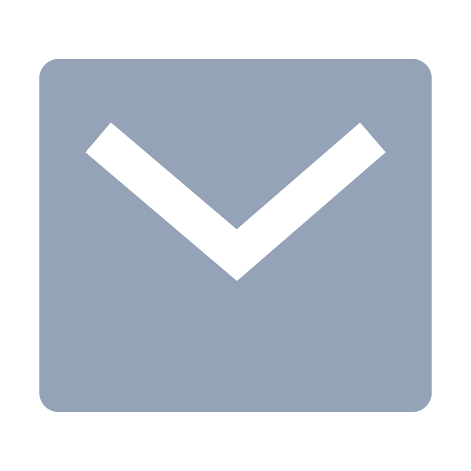
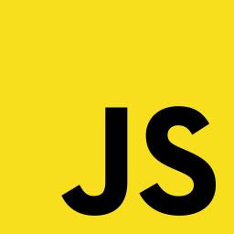
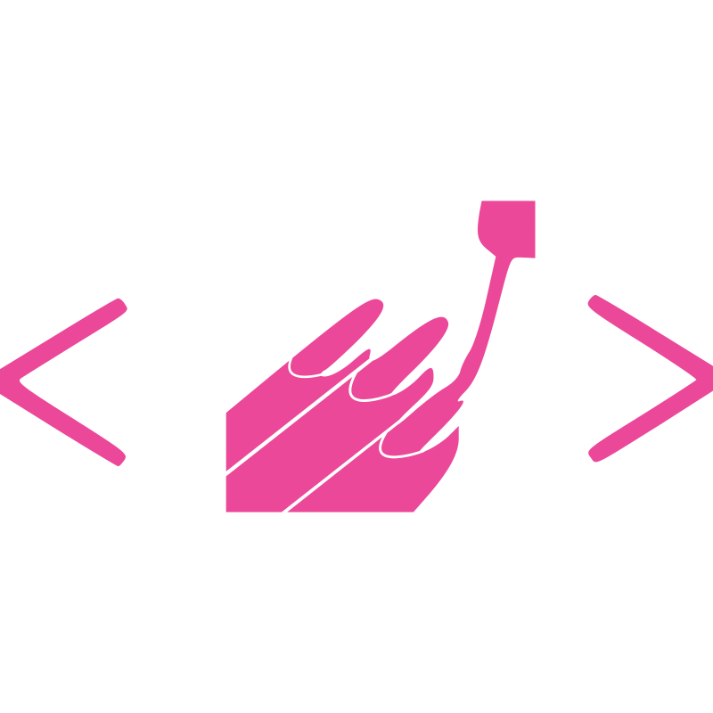
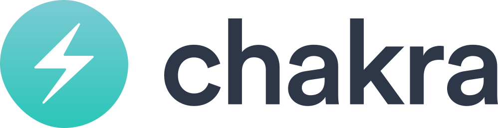
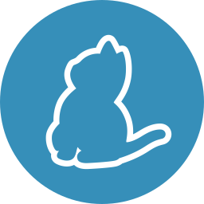
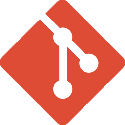
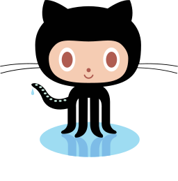

# Hi there, I'm <a href="https://github.com/adiMallya">Adithya</a> 👋

- 🤔 I currently work at Epsilon India as a Quality engineer.
- 🌱 I'm a full stack developer outside of my profession.
- 🔭 I'm looking to make a transition into development full-time.

### 📫 How to reach me:

    &nbsp;
    

### Languages and tools:

     &nbsp;
     &nbsp;
     &nbsp;
     &nbsp;
     &nbsp;
     &nbsp;
     &nbsp;
     &nbsp;
     &nbsp;
     &nbsp;
     &nbsp;
     &nbsp;
     &nbsp;
     &nbsp;
     &nbsp;
     &nbsp;
     &nbsp;

 

<!--
**adiMallya/adiMallya** is a ✨ _special_ ✨ repository because its `README.md` (this file) appears on your GitHub profile.

Here are some ideas to get you started:

- 🔭 I’m currently working on ...
- 🌱 I’m currently learning ...
- 👯 I’m looking to collaborate on ...
- 🤔 I’m looking for help with ...
- 💬 Ask me about ...
- 📫 How to reach me: ...
- 😄 Pronouns: ...
- ⚡ Fun fact: ...
-->
